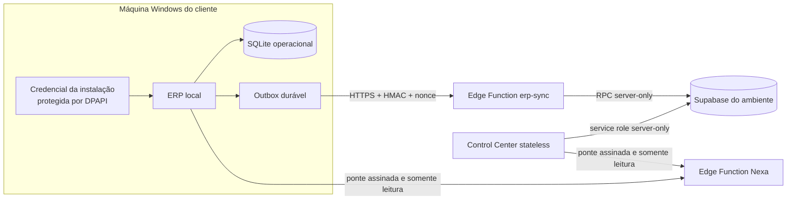

# Deploy de produção: ERP, Supabase e Control Center

## Escopo e princípios

Este guia cobre o plano de produção do ERP NexPoint. Ele não transforma o ERP
desktop em uma aplicação web e não move o banco operacional dos clientes para a
nuvem. Cada instalação continua operando em Windows, apenas em `127.0.0.1`, com
seu SQLite local como fonte autoritativa das operações. A nuvem recebe somente
os envelopes previstos pelo contrato de sincronização, mantém o plano de
controle multiempresa e hospeda o Control Center stateless.

Dados reais nunca devem ser usados em ensaios destrutivos. Não execute reset,
seed ou restauração sobre produção para facilitar um deploy. Segredos ficam no
cofre do provedor, no runtime da Edge Function ou protegidos por DPAPI na
máquina cliente; nenhum deles deve entrar no Git, em imagem, log, chamado ou
captura de tela.

## Arquitetura



Responsabilidades e limites:

- **ERP local:** regras de negócio, interface do cliente, SQLite operacional,
  backup/restauração local e outbox. Uma falha de rede não impede a operação
  local; itens pendentes permanecem na outbox para nova tentativa.
- **`erp-sync`:** recebe lotes limitados, valida instalação, HMAC, timestamp,
  nonce, tamanho e idempotência e só então chama a RPC de ingestão com a
  `service_role`. O navegador nunca participa desse fluxo.
- **Supabase:** persiste tenants, instalações, credenciais verificadoras,
  heartbeats, saúde, diagnósticos, riscos, chamados e auditoria do plano de
  controle. As tabelas usam RLS forçada e não concedem acesso direto a `anon`
  ou `authenticated`.
- **Control Center:** processo web descartável e sem SQLite de produção. Toda
  persistência usa Supabase. O container pode ser substituído sem restauração de
  volume.
- **Nexa:** assistência interna e somente leitura. O contexto é montado no
  backend e sanitizado; indisponibilidade da Nexa não pode interromper o ERP,
  o sync ou o painel.

## Ambientes

Use projetos Supabase e credenciais separados por ambiente. O `project_ref`, a
URL e as chaves de um ambiente devem sempre apontar para o mesmo projeto.

| Camada | Desenvolvimento/local | QA | Produção |
| --- | --- | --- | --- |
| ERP | SQLite e remote local; dados fictícios | tenant `TEST`, modo QA e dados descartáveis | tenant `CUSTOMER` ou `INTERNAL`, SQLite fora do checkout e sync Supabase |
| Supabase | stack local ou projeto DEV | projeto QA isolado | projeto PROD dedicado |
| Control Center | storage local permitido | credenciais e projeto QA | storage Supabase obrigatório, HTTPS e allow-list obrigatórios |
| Seed | somente fictício e explicitamente habilitado | somente base descartável | proibido |

O vocabulário de configuração possui duas formas intencionais: o ERP usa
`LOCAL`, `QA` e `PROD`; o Control Center usa `local`, `development`, `test`,
`qa` e `production`. Não reutilize chaves de DEV/QA em PROD e não conecte um
cliente de teste ao projeto de produção.

## Variáveis de ambiente

As listas abaixo registram apenas os nomes e a finalidade. Os valores devem ser
inseridos diretamente no cofre do ambiente. Variáveis marcadas como secretas
nunca devem ser exportadas para o frontend.

### Control Center de produção

| Nome | Classe | Finalidade |
| --- | --- | --- |
| `CONTROL_CENTER_ENVIRONMENT` | configuração | Ativa o perfil fail-closed de produção. |
| `CONTROL_CENTER_STORAGE` | configuração | Seleciona a persistência remota. |
| `CONTROL_CENTER_HOST` | configuração | Endereço de bind interno do container. |
| `PORT` | configuração do provedor | Porta injetada pelo runtime web. |
| `CONTROL_CENTER_SESSION_SECRET` | **secreta** | Assinatura dos cookies de sessão; mínimo exigido pelo perfil de produção. |
| `CONTROL_CENTER_SUPABASE_URL` | configuração sensível | Origem HTTPS do projeto do ambiente. |
| `CONTROL_CENTER_SUPABASE_PROJECT_REF` | configuração sensível | Identidade explícita do projeto; deve corresponder à URL. |
| `CONTROL_CENTER_SUPABASE_SERVICE_ROLE_KEY` | **secreta** | Acesso server-only ao Data API e às RPCs. |
| `CONTROL_CENTER_PUBLIC_ORIGIN` | configuração | Origem HTTPS canônica, sem caminho. |
| `CONTROL_CENTER_ALLOWED_HOSTS` | configuração | Hosts públicos aceitos, separados por vírgula e sem esquema. |
| `CONTROL_CENTER_TRUST_PROXY` | configuração | Habilita confiança no proxy gerenciado. |
| `CONTROL_CENTER_FORWARDED_ALLOW_IPS` | configuração | IPs dos proxies autorizados a definir o esquema original. |
| `CONTROL_CENTER_MAX_BODY_BYTES` | limite | Limite global de corpo para métodos de escrita. |
| `CONTROL_CENTER_LOGIN_RATE_LIMIT` | limite | Tentativas de login por janela. |
| `CONTROL_CENTER_LOGIN_RATE_WINDOW_SECONDS` | limite | Janela do limitador de login. |
| `CONTROL_CENTER_NEXA_BRIDGE_URL` | configuração opcional | Endpoint `erp-chat`; quando omitido, deriva da URL Supabase. |
| `CONTROL_CENTER_NEXA_BRIDGE_SECRET` | **secreta** | HMAC exclusivo da ponte do Control Center com a Nexa. |
| `CONTROL_CENTER_QA_MODE` | trava | Deve permanecer desabilitado em produção. |
| `CONTROL_CENTER_SEED_DEMO` | trava | Deve permanecer desabilitado em produção. |

Não configure `CONTROL_CENTER_ADMIN_USERNAME` nem
`CONTROL_CENTER_ADMIN_PASSWORD` no processo web de produção. O administrador é
provisionado fora do servidor e persistido no Supabase.

No Render, `RENDER` é fornecida pelo próprio runtime. O `render.yaml` confia no
proxy amplo somente nesse runtime reconhecido. Fora do Render, liste os IPs ou
redes reais do proxy em `CONTROL_CENTER_FORWARDED_ALLOW_IPS`; não use curinga.

### ERP Windows de produção

| Nome | Classe | Finalidade |
| --- | --- | --- |
| `ERP_ENVIRONMENT` | configuração | Seleciona o perfil de produção. |
| `ERP_CHANNEL` | configuração | Canal de atualização coerente com o ambiente. |
| `ERP_DATA_DIR` | caminho local | Diretório absoluto e externo ao checkout para bancos e dados persistentes. |
| `ERP_INSTALLATION_CREDENTIALS_FILE` | caminho local | Arquivo DPAPI absoluto; opcional quando o caminho padrão é usado. |
| `ERP_SUPABASE_URL` | configuração sensível | Origem do mesmo projeto usado no provisionamento. |
| `ERP_SUPABASE_PROJECT_REF` | configuração | Identidade exata do projeto PROD; também pode vir incorporada no manifesto assinado da build. |
| `ERP_TENANT_TYPE` | configuração | Tipo comercial coerente com o tenant provisionado. |
| `ERP_QA_MODE` | trava | Deve permanecer desabilitado em produção. |
| `ERP_VERSION` | release | Versão exibida e sincronizada. |
| `ERP_BUILD` | release | Identificador do build. |
| `ERP_COMMIT` | release | SHA do código-fonte do pacote. |
| `ERP_SYNC_TIMEOUT_SECONDS` | limite | Timeout de rede do sync. |
| `ERP_HEARTBEAT_INTERVAL_SECONDS` | limite | Frequência do heartbeat/outbox. |
| `NEXA_ERP_BRIDGE_URL` | configuração opcional | Endpoint Nexa no mesmo host Supabase. |

Em produção, o segredo da instalação vem do arquivo DPAPI. Ele também deriva a
chave local de sessão e autentica sync/Nexa; não configure uma cópia em texto
por variável. A aplicação exige que o SQLite e a credencial fiquem fora do
repositório.

### Edge Functions

`SUPABASE_URL` e `SUPABASE_SERVICE_ROLE_KEY` são fornecidas pelo runtime
Supabase às funções `erp-sync`, `erp-admin-recovery` e `erp-chat`. Para a Nexa
em PROD, configure no cofre apenas os nomes necessários: `NEXA_ENV`,
`NEXA_PRIMARY_PROVIDER`, `NEXA_FALLBACK_PROVIDER`, `NEXA_RATE_LIMIT_PER_MINUTE`,
`NEXA_ALLOWED_ORIGINS`, `NEXA_AGENT_ENABLED`, `NEXA_WEB_ENABLED`,
`NEXA_KNOWLEDGE_ENABLED`, `NEXA_AGENT_MAX_STEPS`,
`NEXA_AGENT_MAX_TOOL_CALLS`, `NEXA_MAX_WEB_ACTIONS_PER_REQUEST`,
`NEXA_ERP_BRIDGE_SECRET`, `GROQ_API_KEY`, `GROQ_MODEL`, `GROQ_TIMEOUT_MS`,
`GEMINI_API_KEY`, `GEMINI_MODEL` e `GEMINI_TIMEOUT_MS`. Escolha somente
providers reais em produção; `mock` é recusado. Não prefixe variáveis secretas
com nomes destinados ao frontend e nunca use a `service_role` em um cliente ERP
ou navegador.

### Provisionador Windows

O CLI aceita flags interativas ou as variáveis abaixo para automação protegida:

| Nome | Classe | Finalidade |
| --- | --- | --- |
| `SUPABASE_PROJECT_REF` | configuração alternativa | Identidade do projeto quando a variável do Control Center não estiver definida. |
| `SUPABASE_SERVICE_ROLE_KEY` | **secreta alternativa** | Credencial server-only quando a variável do Control Center não estiver definida. |
| `NEXPOINT_PROVISION_TENANT_KEY` | entrada | Identificador estável do tenant. |
| `NEXPOINT_PROVISION_COMPANY_NAME` | entrada | Nome oficial da empresa. |
| `NEXPOINT_PROVISION_TENANT_KIND` | entrada | Tipo permitido para o tenant PROD. |
| `NEXPOINT_PROVISION_INSTALLATION_KEY` | entrada | Identificador estável da instalação. |
| `NEXPOINT_PROVISION_INSTALLATION_LABEL` | entrada | Rótulo operacional da instalação. |
| `NEXPOINT_PROVISION_ADMIN_USERNAME` | entrada | Login inicial do administrador da plataforma. |
| `NEXPOINT_PROVISION_ADMIN_DISPLAY_NAME` | entrada | Nome de exibição do administrador. |
| `NEXPOINT_PROVISION_ADMIN_PASSWORD` | **secreta e transitória** | Senha inicial quando o cofre executa o comando sem TTY. |

Se uma flag e uma variável estiverem presentes, o CLI exige valores idênticos.
Remova as variáveis transitórias do processo ao terminar.

## Preparação e migrations

Antes de qualquer mudança remota:

1. registre o `project_ref` esperado no ticket de mudança e compare-o com a URL;
2. confirme que o backup/PITR do projeto está saudável e teste a restauração em
   um projeto isolado quando a mudança for relevante;
3. execute os testes locais da migration e da Edge Function;
4. revise o diff SQL e procure operações destrutivas, grants amplos e secrets;
5. pause se a identidade do projeto ou o ambiente não puder ser comprovado.

Exemplo de gates locais, sem dados reais:

```powershell
supabase start
supabase db reset
supabase test db
deno test supabase/functions/tests/erp-sync.test.ts
deno test supabase/functions/tests/erp-admin-recovery.test.ts
```

`supabase db reset` acima é permitido apenas no stack local descartável. Nunca
o execute contra projeto remoto ou banco real.

Depois de autenticar a CLI por um mecanismo seguro, vincule e confira o destino
explicitamente:

```powershell
supabase link --project-ref <SUPABASE_PROJECT_REF>
supabase status
supabase migration list --linked
supabase db push --linked --dry-run
```

Só após revisar o dry-run e o backup, aplique a migration aditiva e publique a
função afetada:

```powershell
supabase db push --linked
supabase functions deploy erp-sync --project-ref <SUPABASE_PROJECT_REF> --no-verify-jwt
supabase functions deploy erp-admin-recovery --project-ref <SUPABASE_PROJECT_REF> --no-verify-jwt
# Execute no checkout da Nexa:
supabase functions deploy erp-chat --project-ref <SUPABASE_PROJECT_REF> --no-verify-jwt
```

A opção `--no-verify-jwt` faz parte do contrato atual porque essas pontes usam
HMAC e autenticação própria; cada função ainda falha fechada antes de chamar
uma RPC. O Admin Recovery consome a autorização consultada pelo ID exato, uma
única vez e dentro da validade. O código de `erp-chat` é mantido no repositório
Nexa e deve ser publicado por aquele checkout no mesmo projeto Supabase
NexPoint-ERP, depois dos gates da Nexa e da configuração de providers no secret
manager. Não aplique as migrations do repositório Nexa ao projeto do ERP.

## Build Windows

A build incorpora somente metadados públicos de release e o `project_ref`; a
credencial e o banco continuam externos. Gere o pacote a partir de um commit
limpo e aprovado:

```powershell
.\scripts\build_windows_prod.ps1
```

O script executa a suíte completa por padrão, gera o manifesto `PROD`, usa o
PyInstaller sem console/debug, rejeita bancos e arquivos locais, faz a varredura
de secrets e publica checksums no diretório ignorado `artifacts/windows-build`.
Distribua o ZIP privado e confira seu SHA-256 antes da instalação.

## Provisionamento inicial

Execute o provisionamento somente depois da migration e antes de iniciar a
instalação PROD. O comando deve rodar na máquina Windows final, sob a mesma
conta que executará o ERP, pois o DPAPI usa o escopo `CurrentUser`.

```powershell
.\.venv\Scripts\python.exe scripts\provision_prod.py `
  --tenant-key <TENANT_KEY> `
  --company-name <NOME_EMPRESA> `
  --tenant-kind <customer-ou-internal> `
  --installation-key <INSTALLATION_KEY> `
  --installation-label <ROTULO_INSTALACAO> `
  --admin-username <LOGIN_INTERNO> `
  --admin-display-name <NOME_INTERNO>
```

O script obtém URL e `project_ref` pelas variáveis
`CONTROL_CENTER_SUPABASE_URL` e `CONTROL_CENTER_SUPABASE_PROJECT_REF` ou por
flags equivalentes, sem aceitar destinos divergentes. A `service_role` e a
senha inicial são solicitadas sem eco quando não vierem do cofre. A variável
transitória `NEXPOINT_PROVISION_ADMIN_PASSWORD` existe para automação protegida;
remova-a do processo assim que o comando terminar.

O fluxo cria ou confirma, de forma idempotente, o administrador principal, o
tenant, a instalação e sua credencial. O segredo é gravado primeiro no arquivo
DPAPI e nunca é impresso. Se a chamada remota falhar, uma nova execução reutiliza
a mesma credencial protegida; não gere manualmente outra instalação para
contornar a falha.

Instale também o banco operacional em uma pasta externa. O comando abaixo abre
a origem somente para leitura, cria um snapshot SQLite, executa migrations apenas
na cópia, valida `integrity_check`, `foreign_key_check`, histórico de schema e
Proprietário ativo e então publica o destino de forma atômica:

```powershell
.\.venv\Scripts\python.exe scripts\install_prod_database.py `
  --source .\data\erp.sqlite3
```

O destino padrão é `%LOCALAPPDATA%\NexPoint\ERP\data\erp.sqlite3`, ou
`ERP_DATA_DIR\erp.sqlite3` quando configurado. O instalador nunca sobrescreve um
banco existente. Para um destino já criado, use somente o fluxo oficial de
backup/restore. Feche o ERP durante essa preparação e preserve o backup oficial
da origem.

O destino padrão do arquivo é derivado de `ERP_DATA_DIR`; sem essa variável,
fica sob o diretório de dados local do usuário Windows. Use
`--credentials-file` apenas com caminho absoluto fora do checkout. Depois,
configure o ERP com a mesma URL Supabase, tipo de tenant e caminho de credencial
usados no provisionamento.

O CLI atual cobre o bootstrap inicial. Rotação e revogação são operações de
incidente e devem usar um procedimento administrativo server-only aprovado;
não trate uma nova execução do bootstrap como rotação.

## Sincronização

O ERP grava primeiro a alteração local e enfileira um envelope na mesma base
operacional. O worker envia itens em requisições limitadas por HTTPS. Cada requisição leva ID
da instalação, timestamp, nonce, hash do corpo e HMAC; a Edge Function calcula
o hash da credencial e chama `erp_ingest_sync_batch`. Um item só passa a
sincronizado após o ACK remoto válido. Falhas transitórias mantêm a outbox e
usam novas tentativas; conflitos de idempotência, credenciais inválidas e itens
em dead letter exigem investigação.

O plano de controle não é réplica integral do SQLite. Não use Supabase para
reconstruir vendas, caixa, pagamentos ou histórico local. Monitore ao menos:

- idade e volume da outbox pendente;
- último heartbeat por instalação;
- taxa de ACK, retry e dead letter;
- respostas `401`, `409`, `429`, `502` e `503` da função;
- divergência de versão/build e instalações suspensas ou revogadas.

Durante indisponibilidade remota, preserve a operação local e a outbox. Não
apague itens para “destravar” o painel. Depois da recuperação, confirme ACKs e
redução da fila antes de encerrar o incidente.

A rotina administrativa `np_admin_prune_expired_telemetry` aplica a retenção em
lotes: o payload do envelope é redigido após 30, 90 ou 180 dias conforme o tipo,
mantendo o hash e a prova de idempotência; após 730 dias e pelo menos mais 30
dias de tombstone, remove primeiro o ACK e depois o envelope. Evidências ligadas
a incidentes ativos são preservadas. Execute a rotina por agendamento
server-only e monitore as contagens retornadas.

## Nexa

O ERP e o Control Center enviam à Nexa apenas contexto permitido e sanitizado,
assinado por HMAC. A Nexa é somente leitura: não recebe SQL arbitrário, não
executa operações financeiras, não redefine senha e não substitui as regras de
autorização do backend.

O endpoint do Control Center deve estar no mesmo host Supabase configurado para
o ambiente. `CONTROL_CENTER_NEXA_BRIDGE_SECRET` é separado da credencial de
sessão e deve corresponder ao segredo configurado na função Nexa. O ERP PROD usa
sua credencial de instalação para o contrato próprio da ponte. Faça rotação
coordenada, sem registrar o valor anterior ou novo.

A Edge Function Nexa tem seu código-fonte no repositório Nexa, mas a integração
ERP PROD é publicada no projeto Supabase NexPoint-ERP. Se ela estiver
indisponível, o painel deve mostrar indisponibilidade temporária e continuar
oferecendo os demais fluxos.

## Deploy do Control Center

O `Dockerfile` copia somente os módulos necessários, instala o runtime web sem
dependências desktop, torna a árvore da aplicação somente leitura e executa
como usuário sem privilégios. Não monte `data/`, banco SQLite ou diretório de
backup no container de produção.

Antes de publicar, valide a imagem localmente:

```powershell
docker build --pull --tag nexpoint-control-center:<VERSAO> .
docker image inspect nexpoint-control-center:<VERSAO>
```

No Render, crie o serviço pelo `render.yaml`, preencha todas as entradas
`sync: false` no painel seguro e mantenha `autoDeploy` desabilitado. A origem
pública deve ser a URL HTTPS exata; a allow-list recebe apenas os hosts do
serviço e dos domínios personalizados, sem esquema nem caminho. Não adicione
as variáveis de bootstrap local. O Blueprint desabilita previews e fixa uma
instância, pois o limitador de login atual vive no processo. Só escale
horizontalmente depois de adicionar limitação compartilhada no proxy ou em um
serviço central.

Promova a imagem imutável somente depois de aplicar a migration compatível e
publicar `erp-sync`. O gate pós-deploy é:

1. `GET /health` responde `200` com serviço, ambiente e storage esperados;
2. uma tentativa HTTP externa é redirecionada pelo provedor e chega ao app como
   HTTPS confiável;
3. host fora da allow-list é rejeitado;
4. login do administrador provisionado funciona e cookie é `Secure`/`HttpOnly`;
5. dashboard lê Supabase e respeita escopo de tenant;
6. um cliente piloto envia heartbeat e recebe ACK sem duplicação;
7. Nexa falha de forma isolada quando propositalmente indisponível.

O health check consulta a prontidão do repositório Supabase e retorna `503` se
ela não puder ser comprovada. Não use a página autenticada como health check.

## Backup e restauração

Há dois domínios independentes de backup:

### ERP local

O SQLite operacional continua seguindo
[`BACKUP_RESTAURACAO_ATUALIZACAO.md`](BACKUP_RESTAURACAO_ATUALIZACAO.md). Use o
snapshot consistente do próprio ERP, manifesto e verificações de integridade.
Copie backups para armazenamento cifrado e com retenção fora da máquina, de
acordo com a política da empresa. Teste a restauração em cópia isolada.

Uma restauração local é preparada e aplicada antes de abrir o engine no próximo
início, com backup de rollback e troca atômica. Nunca substitua `erp.sqlite3`
enquanto o processo estiver aberto e nunca use dados do plano de controle para
fabricar um banco operacional.

### Supabase e Control Center

Habilite a política de backup/PITR compatível com o RPO/RTO do ambiente e
registre periodicamente evidência de restauração em outro projeto. Antes de uma
migration, preserve um ponto recuperável e registre o horário UTC. O container
do Control Center não possui estado a restaurar; recupere Supabase e publique
novamente a mesma imagem/configuração.

Uma restauração Supabase afeta tenants simultaneamente. Durante o procedimento,
interrompa ingestão/sync e provisionamentos, preserve os bancos locais e avalie
os ACKs emitidos depois do ponto restaurado antes de reabrir o tráfego. A outbox
local deve reenviar itens idempotentes; não a limpe.

## Rollback e incidente

O rollback normal do web service troca a imagem pelo digest anterior e mantém o
banco. A migration deve ser retrocompatível com a versão anterior do Control
Center e da Edge Function. Prefira correção aditiva à reversão SQL. Não remova
colunas, tipos, funções ou grants usados por clientes ainda instalados.

Para uma Edge Function defeituosa, republique a versão anterior compatível ou
corrija à frente e valide um cliente piloto. Para uma migration já usada por
produção, não aplique SQL inverso sem ensaio de restauração, janela de mudança e
análise das gravações ocorridas depois dela.

Runbook de incidente:

1. declare o ambiente e o intervalo UTC afetados; suspenda novos deploys e
   provisionamentos;
2. preserve logs sanitizados, request IDs, versão, build e métricas, sem copiar
   payloads ou secrets;
3. mantenha os ERPs locais operando quando a falha estiver apenas na nuvem;
4. se houver suspeita de credencial, suspenda/revogue a instalação ou chave no
   backend server-only, substitua o segredo no cofre e reprovisione/rotacione por
   procedimento aprovado;
5. reverta imagem/função quando o schema continuar compatível; caso contrário,
   isole o tráfego e execute a restauração Supabase coordenada;
6. valide `/health`, login, escopo de tenant, heartbeat, ACK/idempotência, Nexa
   isolada e ausência de dead letters crescentes;
7. reabra gradualmente, começando por uma instalação piloto, e documente causa,
   impacto e ação preventiva.

Se a `service_role` vazar, trate todo o plano de controle como comprometido:
rotacione a chave no provedor, atualize apenas workloads server-only, invalide a
anterior e audite acessos. Se uma credencial de instalação vazar, limite a ação
àquela instalação sempre que a evidência permitir.

## Atualizações

Use artefatos imutáveis e registre versão, commit, digest da imagem, migration e
versão das funções em cada release. A ordem segura para uma mudança compatível é:

1. backup e migration aditiva;
2. Edge Function compatível com clientes antigos e novos;
3. Control Center;
4. piloto do ERP Windows;
5. expansão gradual para os demais clientes.

O atualizador automático do ERP permanece não configurado até existir canal
confiável com manifesto assinado, hash, chave pública incorporada, staging,
backup e rollback verificados. A existência do Control Center não autoriza
download ou execução remota de pacotes nas máquinas clientes.

## Runbook operacional resumido

### Nova release

- confirme checkout, branch, commit e árvore de trabalho;
- rode testes Python relevantes, pgTAP, teste Deno e varredura de secrets;
- confirme projeto Supabase e backup;
- aplique migration, publique função, promova imagem e valide os gates;
- registre evidências sem valores secretos.

### Nova instalação

- confirme contrato do cliente, tipo de tenant e identificadores únicos;
- execute `install_prod_database.py` sobre a origem/backup aprovado;
- execute `provision_prod.py` na máquina final e na conta final;
- confirme permissões do arquivo DPAPI e diretório de dados;
- inicie o ERP, valide banco local, heartbeat, sync, versão e saúde no painel;
- guarde a evidência de provisionamento sem segredo.

### Rotina

- observar `/health`, disponibilidade Supabase e erros das funções;
- acompanhar heartbeat, outbox, retry/dead letter e versões divergentes;
- testar backups locais e do plano de controle conforme RPO/RTO;
- revisar usuários internos, escopos de tenant e instalações inativas;
- manter `autoDeploy` desabilitado e promover mudanças em janela controlada.

### Encerramento de instalação

- revogar/suspender a credencial remota por procedimento server-only;
- preservar o banco e backups locais conforme retenção contratual;
- remover acesso dos operadores e registrar auditoria;
- nunca apagar histórico para apenas retirar a instalação do dashboard.
